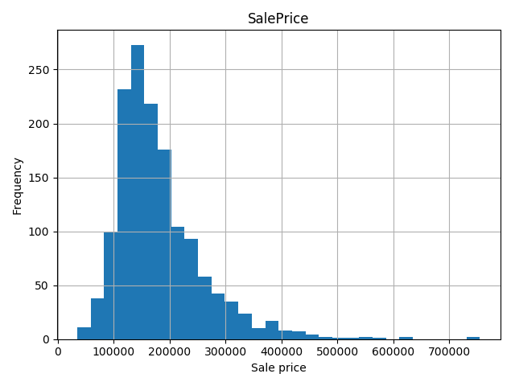
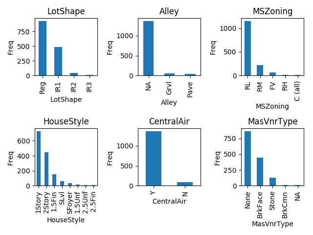
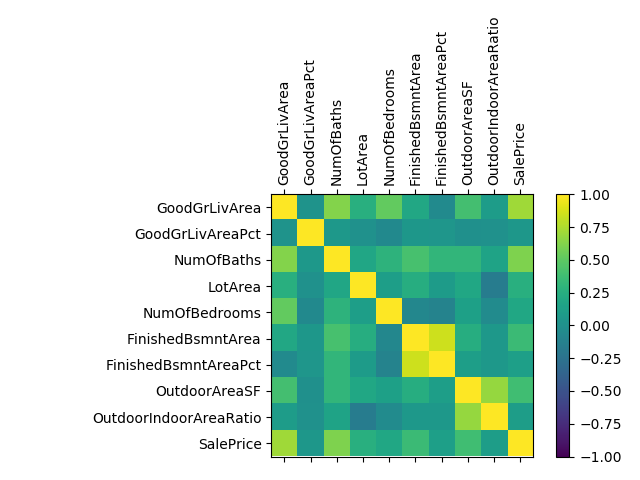

# House_Sale_Prices_Prediction_Kaggle
House sale price prediction problem (from Kaggle)

The goal in the House sale price prediction kaggle comeptition is to predict the sale price of a house in the USA.
Each house is characterized by more that 70 different features, describing its shape, condition, size and other properties.
The project consits of:
* Data exploration
* Feauture engineering
* Feature selection
* Training diffrent regression models
* Evaluation on the provided test

Here are some cool visualization plots of the data (generated by the Matplotlib Python packge). The plots visualize the distribution of the sale price of the houses, shows the correlation berween new numeric features, and give a sense of the typical house properties.





Ensemble of different regressors is used:
 - RandomForestRegressor
 - XGBRegressor
 - ExtraTreesRegressor
 - GradientBoostingRegressor

Final log output for example:
```
Statistics for dataframe in path: Data/train.csv:
-INFO- Number of rows: 1460
-INFO- Number of columns: 80
-INFO- Number of numeric columns (before pre-processing): 34
-INFO- Number of categorical columns (before pre-processing): 46

--OK-- Train and test files have the same number of columns!
Performing pre-process...
##### Dropping index column...
##### Dropped 0 columns: []...
##### Dropped 0 rows...
##### No NaN values have been found...
##### Considering only specified 41 feature columns: ['MoSold', 'YrSold', 'Fence', 'PoolQC', 'BsmtCond', 'BldgType', 'Condition1', 'Condition2', 'OverallCond', 'OverallQual', 'MSZoning', 'Alley', 'LotShape', 'HouseStyle', 'CentralAir', 'RoofStyle', 'LandSlope', 'LotArea', 'YearBuilt', 'YearRemodAdd', 'Electrical', 'SaleCondition', 'LowQualFinSF', 'GrLivArea', 'BsmtFullBath', 'BsmtHalfBath', 'FullBath', 'HalfBath', 'BsmtQual', 'ExterCond', 'BedroomAbvGr', 'BsmtUnfSF', 'TotalBsmtSF', 'Foundation', 'PavedDrive', 'WoodDeckSF', 'OpenPorchSF', 'EnclosedPorch', '3SsnPorch', 'ScreenPorch', 'PoolArea']
##### No NaN values have been found...
##### Considering only specified 41 feature columns: ['MoSold', 'YrSold', 'Fence', 'PoolQC', 'BsmtCond', 'BldgType', 'Condition1', 'Condition2', 'OverallCond', 'OverallQual', 'MSZoning', 'Alley', 'LotShape', 'HouseStyle', 'CentralAir', 'RoofStyle', 'LandSlope', 'LotArea', 'YearBuilt', 'YearRemodAdd', 'Electrical', 'SaleCondition', 'LowQualFinSF', 'GrLivArea', 'BsmtFullBath', 'BsmtHalfBath', 'FullBath', 'HalfBath', 'BsmtQual', 'ExterCond', 'BedroomAbvGr', 'BsmtUnfSF', 'TotalBsmtSF', 'Foundation', 'PavedDrive', 'WoodDeckSF', 'OpenPorchSF', 'EnclosedPorch', '3SsnPorch', 'ScreenPorch', 'PoolArea']

>>>>> Matching train features to test set - total 61 features columns
||||| PCA performed is fitted on train data with 40 components
||||| Training classifier: RandomForestClassifier
||||| Training RandomForestClassifier classifier completed in 15.586257219314575 seconds
||||| Predicting with classifier: RandomForestClassifier
||||| Predicting with RandomForestClassifier classifier completed in 0.08377623558044434 seconds
||||| Predicting with classifier: RandomForestClassifier
||||| Predicting with RandomForestClassifier classifier completed in 0.09574341773986816 seconds
MSE of RandomForestClassifier alone on train set:1033391130.5552438
--------------------------------------------------------------------
||||| Training classifier: XGBoost
||||| Training XGBoost classifier completed in 4.350362062454224 seconds
||||| Predicting with classifier: XGBoost
||||| Predicting with XGBoost classifier completed in 0.10471963882446289 seconds
||||| Predicting with classifier: XGBoost
||||| Predicting with XGBoost classifier completed in 0.10675811767578125 seconds
MSE of XGBoost alone on train set:50976.88233880866
--------------------------------------------------------------------
||||| Training classifier: ExtraTreeReggresor
||||| Training ExtraTreeReggresor classifier completed in 2.7246649265289307 seconds
||||| Predicting with classifier: ExtraTreeReggresor
||||| Predicting with ExtraTreeReggresor classifier completed in 0.08976197242736816 seconds
||||| Predicting with classifier: ExtraTreeReggresor
||||| Predicting with ExtraTreeReggresor classifier completed in 0.10276174545288086 seconds
MSE of ExtraTreeReggresor alone on train set:1624127364.2560942
--------------------------------------------------------------------
||||| Training classifier: GradientBoostingRegressor
||||| Training GradientBoostingRegressor classifier completed in 4.076057195663452 seconds
||||| Predicting with classifier: GradientBoostingRegressor
||||| Predicting with GradientBoostingRegressor classifier completed in 0.04089093208312988 seconds
||||| Predicting with classifier: GradientBoostingRegressor
||||| Predicting with GradientBoostingRegressor classifier completed in 0.04388260841369629 seconds
MSE of GradientBoostingRegressor alone on train set:82740.79938678427
--------------------------------------------------------------------
```
